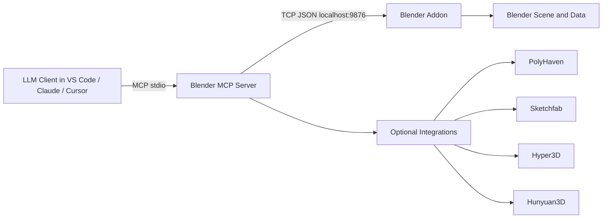
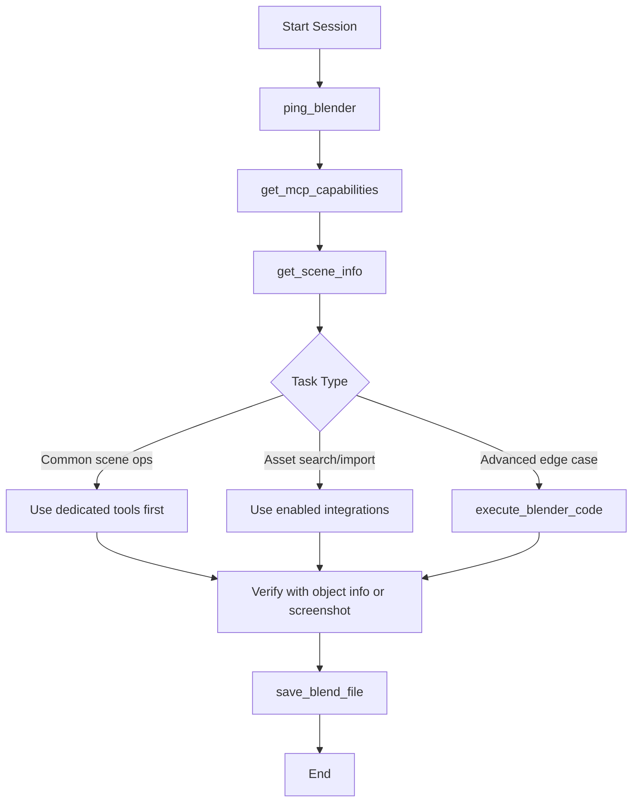

# Blender MCP v2.0.0

A practical, production-ready Blender MCP for real LLM workflows.

**Author:** Aymen Mabrouk  

**Project context:** Developed under **SeekMake internship** as part of a **final-year engineering project**.

---

## What this project is

`blender-mcp` connects an LLM to Blender through MCP so the model can:

- inspect a scene,
- create and edit objects,
- manage materials/lights/camera,
- animate,
- render/export,
- and fall back to Python execution when needed.

The design goal is **simple + robust**, not over-engineered.

---

## Why this v2 matters

This version is optimized for immediate use and reliability:

- Dedicated tools for common operations (deterministic, LLM-friendly)
- Clean fallback path with `execute_blender_code`
- Live connectivity and capability checks (`ping_blender`, `get_mcp_capabilities`)
- Session control tools (`select_objects`, `frame_control`, `save_blend_file`, `open_blend_file`, `import_file`)
- Optional integrations (PolyHaven / Sketchfab / Hyper3D / Hunyuan3D)
- Optional docs search (`search_blender_docs`) that degrades gracefully when docs path is unavailable

---

## System architecture



---

## Recommended LLM execution order

> The starter prompt improves consistency and reduces unexpected tool use.



---

## Tooling surface

### Core tools (always available)

- **Session/health**: `ping_blender`, `get_mcp_capabilities`
- **Scene inspection**: `get_scene_info`, `get_object_info`, `get_viewport_screenshot`
- **Object workflows**: `create_object`, `delete_object`, `duplicate_object`, `join_objects`, `set_parent`, `set_transform`, `apply_transforms`, `select_objects`
- **Modifiers**: `add_modifier`, `remove_modifier`, `apply_modifier`
- **Materials**: `create_material`, `assign_material`
- **Camera/lights**: `set_camera`, `add_light`
- **Animation/timeline**: `set_keyframe`, `frame_control`
- **Collections/files**: `manage_collection`, `save_blend_file`, `open_blend_file`, `import_file`
- **Output**: `render_image`, `export_scene`
- **Advanced fallback**: `execute_blender_code`
- **Optional docs utility**: `search_blender_docs`

### Integrations (enable in Blender UI)

- PolyHaven
- Sketchfab
- Hyper3D Rodin
- Hunyuan3D

---

## Install and run (Windows, step-by-step)

### 1) Install the Blender addon

1. Open Blender
2. Go to **Edit → Preferences → Add-ons**
3. Disable/remove old Blender MCP addon (recommended)
4. Click **Install...** and choose `addon.py` from this folder
5. Enable **Blender MCP**

### 2) Configure MCP in VS Code

In your `mcp.json`, use:

```json
{
  "servers": {
    "blender": {
      "type": "stdio",
      "command": "uvx",
      "args": [
        "--from",
        "git+https://github.com/AymenMB/Blender-mcp.git",
        "blender-mcp"
      ]
    }
  }
}
```

> Uses `uvx` to run the GitHub package.

### 3) Start session

1. Restart VS Code after MCP config changes
2. In Blender sidebar (`N`) → `BlenderMCP` panel
3. Click **Connect to MCP server**
4. In LLM chat, call:
   - `ping_blender`
   - `get_mcp_capabilities`
   - `get_scene_info`

---


## Prompt engineering in this repo

Two MCP prompts are exposed:

- `asset_creation_strategy`
- `llm_starter_system_prompt`

They exist to reduce LLM randomness and enforce a stable tool-ordering policy.

---

## Known limitations (important, quick summary)

### Why AI-generated 3D meshes are still hard to edit

This is an ecosystem-wide limitation (not specific to this MCP):

1. **No part separation**: many generated models are fused into one mesh.
2. **No construction history**: unlike CAD feature trees, there is no editable operation stack.
3. **Topology defects**: non-manifold edges, holes, self-intersections, disconnected islands.
4. **Uneven triangle density**: difficult to perform uniform edits.
5. **Texture/geometry confusion**: visual details are sometimes baked as geometry.

By contrast, manually modeled files are easier due to named parts, cleaner topology, watertight meshes, and structured workflows.

---

## Environment variables

| Variable | Default | Purpose |
| --- | --- | --- |
| `BLENDER_HOST` | `localhost` | Blender socket host |
| `BLENDER_PORT` | `9876` | Blender socket port |
| `BLENDER_DOCS_PATH` | auto | Optional docs folder path for `search_blender_docs` |

---

## Validation status

This project was validated with:

- live MCP connection checks,
- complex scene creation/editing,
- screenshot/render/export/import cycles,
- scripted end-to-end tool tests with pass/fail reporting.

---

## Final note

This Blender MCP implementation was created by **Aymen Mabrouk** during a **SeekMake internship** for a **final-year engineering project**, with focus on practical reliability for real LLM-driven 3D workflows.
